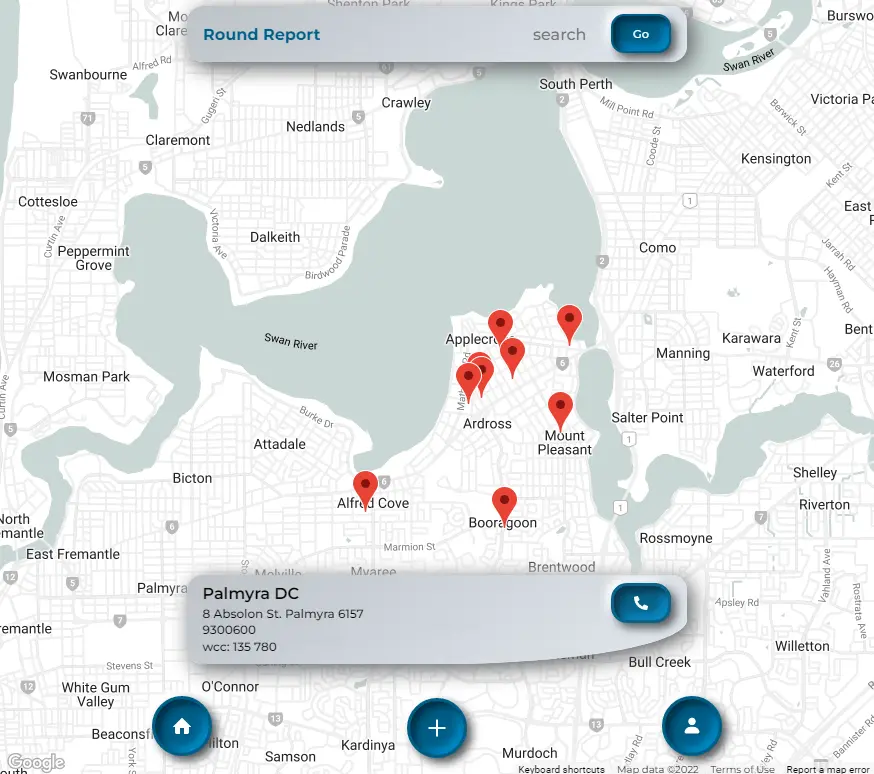

# Round Report v2
Redesign of round report app frontend.

Still in production - deployed to netlify and heroku.

[Here is link to the Backend repository](https://github.com/brett-treweek/round-report-v2-backend)
 


[Here is a link to the deployed App on Netlify](https://round-report.netlify.app)  


## Description
This is a complete rebuild of the 'Round Report' web application that I built for my final project in the UWA coding bootcamp that I completed in 2021. At the request of my line manager at Australia Post, I will demo this app to state management and possibly trial it at my Delivery Centre when it is ready.

This web application was developed to address the problem posties have in recording, viewing and communicating the hazards they come across when on delivery. Posties face a variety of hazards, some of which they have no control over, but many that can be avoided if they are aware of them. For example- knowing whether or not an aggresive dog lives at a certain address. The key here is providing posties who are delivering in an unfamiliar area the means to quickly and easily view the hazards in that area.


The first release of this app is responsive for mobile devices, allows for users to log in with jwt authentication, lets users quickly view and add hazards with images, and has a round report page with round specific information. Google maps API is implemented with Places and Geocoding API for a great user experience when submitting hazards.  

---
## Table of Contents


- [Usage](#usage)
- [License](#license)
- [Contributing](#contributing)
- [Tests](#tests)
- [Technologies](#technologies)
- [Future Development](#future-development)
- [Questions](#questions)

---

## Usage

Please sign up to add hazards or use these credentials to sign in.

```
Email: brett@mail.com
Password: qwerty
```
 

[Here is a link to the deployed App.](https://round-report.netlify.app)


---
## License

This project is licensed under 

---
## Contributing

Contributing to this project is not currently available.

---
## Tests

Please use these commands to perform tests.

```js

There are no tests at present.

```

---

## Technologies

- MongoDb
- Javascript
- Google Maps js API
- Google Places API
- Google Geocoding API
- Express
- JWT
- Dotenv
- React
- Atlas
- Mongoose
- Node.js
- Bcrypt
- HTML
- CSS
- Snazzymaps.com
- Git

---

## Future Development  

- Adding photos of hazards. (DONE)
- Editing and deleting hazards. (COMING SOON)
- Adding comments to hazards.
- Mapping out routes to start of round from Delivery Centre. (COMING SOON)
- Adding markers to round map for post offices, toilets, petrol stations etc. (COMING SOON)
- Adding admin authentication to add, edit, delete Rounds. (COMING SOON)
- Adding other important round information like entry codes.
- Implementing weather reports.
- Traffic conditions on map.
- Best places for coffee/food for each round with comments.


---

## Questions

For any questions and support please contact Brett Treweek  
- Email: bretttrew@gmail.com  
- Github: [brett-treweek](https://github.com/brett-treweek)
